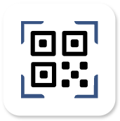
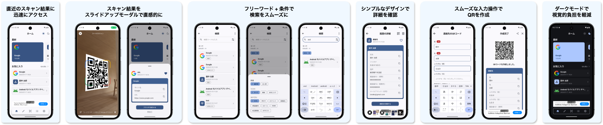

  
  

    
コードリーダー

    

      QR/バーコードをスキャンするAndroidアプリ
    

  

    

        開発期間 : 2025年2月〜2025年5月 
        総作業時間の目安 : 週20時間 × 17週（約340時間） 
        リリース状況 : 非公開
    

## 目次

 - [開発背景](#開発背景)
 - [課題と解決方法](#課題と解決方法)
 - [技術スタック](#技術スタック)
 - [非機能](#非機能)
 - [機能](#機能)
 - [画面](#画面)
 - [モジュール構成](#モジュール構成)
   - [アプリ全体構成](#アプリ全体構成)
   - [Featureモジュール](#featureモジュール)
   - [Coreモジュール](#coreモジュール)
 - [実装上の工夫](#実装上の工夫)

## 開発背景

市場には既に多くのQRコードスキャンアプリが存在します。

その中にはダウンロード数が5億以上、レビュー評価が4.6のアプリもあります。

ダウンロード数が5億に届かないにしても、1000万以上、100万以上、レビュー評価が4以上と多くの人に愛される素晴らしいアプリばかりです。

しかし、どんなに素晴らしいアプリであっても、使っているうちに「こういう風にした方がいいかも？」なんて思うこともあります。

コードリーダーは、「こういう風にした方がいいかも？」の課題に対して私がどのようなアプローチで解決するかを示すために開発しました。

## 課題と解決方法

[開発背景](#開発背景) に記載した内容を踏まえ、Google Play Storeで配信されているアプリについて、私が「こういう風にした方がいいかも？」と感じた点を課題として定義しました。

| No. | 課題 | 詳細 | 解決方法 |
| - | - | - | - |
| 1 | タップする回数を削減 | 目的の画面に辿り着くまでに必要な操作回数が多くもどかしさを感じた。 某アプリでは直近のスキャン結果の確認に**4回**のタップを要した。  1. アプリ起動 2. ハンバーガーメニューをタップ 3. ドロワーメニューの履歴ボタンをタップ 4. 履歴一覧から直近のスキャン結果をタップ | ホーム画面に直近のスキャン結果を表示するためのUIを配置して最短**2回**のタップで確認可能にする。  1. アプリ起動 2. 直近のスキャン結果をタップ |
| 2 | 一覧表示のアイテムを見分けやすく | 一覧に複数のURL形式のアイテムが並ぶ。 ラベルにURL（https://〜）のみが設定されていた。 URLのみで見分けられる場合もあるが、少し見分けにくさを感じた。  日常生活でURL形式のQRをスキャンする頻度は多いように思う。（店舗紹介や商品紹介、飲食店のメニューなど） そのため、見分けにくさの解消は大切な課題と判断。 | URLからサイトのページ名、ファビコンを取得して表示する。 |
| 3 | 検索機能を使いやすく | フリーワード検索機能を搭載していると検索がスムーズに行えるが、文字を入力しなくてもある程度絞り込めた方が楽だと思う。 | フリーワード検索機能と絞り込み条件を設定する機能を追加する。 |
| 4 | 詳細画面を見やすく整理 | 詳細画面にスキャン結果のデータを羅列しているだけのアプリを幾つか見た。 大抵の場合、表示されているデータを見れば何のデータかを判断できると思う。 けれど、項目名を併せて表示した方が誤解もなく、スッキリした見た目になるように思う。 | データを整理して表形式で表示する。 煩わしくない表現で項目名も表示する。 |
| 5 | 文字を入力しやすく | QR作成機能を備えたQRスキャンアプリは多い。 QRを作成するときの情報入力画面で幾つか操作をしずらい点を見つけた。  ・セーフエリアがない ・IMEアクション制御がない（次へ、決定） ・入力完了ボタンをタップ後にバリデーションエラーメッセージが表示されるが、入力フォームに入力形式の記載がなく少し不親切 ・入力画面表示時に入力フォームにオートフォーカスした方が便利かも | ・セーフエリアを設定 ・プレースホルダーに文字の入力形式を明記 ・入力バリデーションの作成 ・入力項目に合わせて表示するキーボードを変更（数字、英語など） ・IMEアクション制御（次へ、決定） ・入力画面表示時のオートフォーカス + キーボード表示 ・入力フォームの枠色の設定（未入力、入力中、入力済） ・入力画面を離れる際に確認ダイアログを表示 ・必須の入力項目か否かをラベルで表示 |

## 技術スタック

| 分類 | 言語、ライブラリなど |
| - | - |
| 開発言語 | Kotlin |
| FW | Jetpack Compose |
| アーキテクチャ | MVVM、Clean Architecture |
| ビルド | Kotlin DSL、Version Catalog、Convention Plugins |
| 画面遷移 | Jetpack Navigation Component |
| 非同期処理 | Coroutines、Flow、StateFlow |
| DI | Hilt |
| DB | Room ※暗号化 / 複合 に Tink を使用 |
| プリファレンスストア | DataStore ※利用規約同意の有無、ダークモード設定、ダイナミックカラー設定、履歴保存の要否、スキャン設定を管理 |
| UnitTest | JUnit4、Truth、Turbine、Mockito、Kover |
| QR / バーコードスキャン機能 | Google Code Scanner、MlKit |
| QR作成機能 | Zixing |
| URL形式のスキャン結果の表示 | Jsoup（サイト名取得）、Coil（ファビコン表示） |
| ブラウザ表示 | Chrome Custom Tabs |
| ナビゲーションバーの表示切り替え | Adaptive Navigation Suite |
| ライセンス表示 | OSS Licenses |
| 広告 | AdMob |
| CI/CD | CircleCI ※UnitTest、Firebase AppDistribution への配布を自動化 |

## 非機能

| 分類 | 内容 |
| - | - |
| 対応OS | Android OS10以降 |
| パフォーマンス | 通常の利用でストレスを感じない動作速度 |
| セキュリティ | アプリ内データベースに暗号化してデータ保存（Room + Tink） |
| 可用性 | オフラインでも基本操作が可能 （スキャンモジュールがインストール済みの前提） |
| UI/UX | 分かりやすくシンプル、且つ、直感的な画面設計 |

## 機能

| 機能名 | 概要 |
|-|-|
| QRコード / バーコードのスキャン | QRコード / バーコードを端末のカメラで読み取る。 読み取った情報を解析して結果をDBに保存する。 解析結果を表示する。 |
| スキャン結果の一覧表示 | スキャン結果を要約してリスト形式で表示する。 |
| スキャン結果の詳細表示 | スキャン結果の詳細を表形式で表示する。 |
| スキャン結果の削除 | 一覧表示は複数選択削除、一括削除の機能を備える。 詳細表示も削除機能を備える。 |
| スキャン結果のお気に入り登録 | スキャン機能をお気に入り登録する。 お気に入りを解除する機能も備える。 |
| スキャン結果の検索 | 任意の検索ワード、追加条件（履歴、お気に入り、データ形式）、昇順 / 降順を使用して検索する。 |
| スキャン結果の共有 | QR画像形式で端末内の他アプリを介して共有する。 |
| スキャン結果の他アプリ連携 | データ形式ごとに最適な連携を可能にする。 ・URL : ブラウザ表示 ・カレンダーイベント : カレンダー保存、イベント開催場所のGoogle Map検索 ・連絡先 : 電話帳登録、電話発信 ・メール : メール作成 ・SMS : SMS作成、電話発信 ・位置情報 : Google Map検索 |
| QRコードの作成 | URL、Wi-Fi設定情報、カレンダーイベント、連絡先、メール、SMS、電話番号、位置情報、テキスト（文章）形式のQRコードを作成する。 |
| 作成したQRコードの一覧表示 | 作成したQRコードをリスト形式で表示する。 |
| 作成したQRコードの詳細表示 | 作成したQRコードの詳細を表形式で表示する。 |
| 作成したQRコードの削除 | 一覧表示は複数選択削除、一括削除の機能を備える。 詳細表示も削除機能を備える。 |
| 作成したQRコードの共有 | QR画像形式で端末内の他アプリを介して共有する。 |
| スキャン機能のオプション設定 | スキャンする対象の形式に合わせてオプションを設定する。 （QR CODE、AZTEC、CODE128、CODE39、CODE93、CODEBAR、DATA MATRIX、ITF、PDF417） |
| アプリのテーマ切り替え | ダイナミックカラーに対応する。 ダークモードに対応する。 |

## 画面

* [スプラッシュ](screen/splash.md)
* [利用規約同意](screen/agree_terms)
* [ホーム](screen/home.md)
* [QR作成種類選択](screen/choose_create_qr.md)
* [QR作成](screen/create_qr.md)
* [作成済みQRコード一覧](screen/created_qr_list.md)
* [作成済みQRコード詳細](screen/created_qr_detail.md)
* [履歴一覧](screen/history_list.md)
* [履歴詳細](screen/history_detail.md)
* [お気に入り一覧](screen/favorite_list.md)
* [お気に入り詳細](screen/favorite_detail.md)
* [検索](screen/search.md)
* [設定](screen/settings.md)

## モジュール構成

### アプリ全体構成

* [:app](module/app.md) - 全体の依存関係を俯瞰

### Featureモジュール

各画面が依存するモジュール構成

* [:feature:home](module/feature/home.md) - ホーム
* [:feature:create](module/feature/create.md) - QR作成種類選択、QR作成、作成済みQRコード一覧、作成済みQRコード詳細
* [:feature:list](module/feature/list.md) - 履歴一覧、履歴詳細、お気に入り一覧、お気に入り詳細
* [:feature:search](module/feature/search.md) - 検索
* [:feature:setting](module/feature/setting.md) - 設定

### Coreモジュール

各レイヤーが依存するモジュール構成

* [:core:common](module/core/common.md) - Commonレイヤー
* [:core:data](module/core/data.md) - Dataレイヤー
* [:core:database](module/core/database.md) - DataBaseレイヤー
* [:core:datastrore](module/core/datastrore.md)  - DataStoreレイヤー
* [:core:designsystem](module/core/designsystem.md) - Designsystemレイヤー
* [:core:domain](module/core/domain.md) - Domainレイヤー
* [:core:utils](module/core/utils.md) - Utilsレイヤー

## 実装上の工夫

| No. | 概要 | 詳細 |
| - | - | - |
| 1 | スキャン結果の補完 | MlKitを利用したスキャン結果の解析において、連絡先形式のデータ（電話番号・メールアドレス）にラベルが付与されていないケースが頻発したため、バーコードにエンコードされたVCARD形式のデータを独自に解析し、ラベル情報を補完する処理を実装しました。 |
| 2 | スキャン結果データの管理 | スキャン結果にはURL、Wi-Fi、カレンダーイベントなど複数の形式が存在します。 これらを明確に状態管理し、when式による網羅性を担保するため、Sealed Classを活用しました。  また、スキャン結果のタイトルとして表示する情報を抽象化したプロパティで管理することで、データ形式に依存せず表示処理を記述可能にしました。 データ形式の追加にも柔軟に対応できる設計としています。 |
| 3 | スキャン結果一覧表示時のアイテムの可読性向上 | 同じデータ形式のアイテムが並ぶ場合、アイコンのみでは判別しにくいため、以下のように代表的な情報を併せて表示する仕組みを導入しました。  ・Wi-Fi形式：SSID ・連絡先形式：姓名 ・カレンダーイベント形式：イベントタイトル |
| 4 | 一覧表示アイテムの複数選択削除対応 | 状態管理の明確化のため、Sealed Classによる状態管理（初期状態・未選択状態・選択済み状態）を導入しました。  また、スキャン結果のデータを抽象化したプロパティで扱うことで、データ形式に依存せず描画できる仕組みを実現しています。 |
| 5 | 一覧表示アイテム削除用ドロップダウンメニューの動的切り替え | メニューに常に全てのボタンを表示すると煩雑になりがちであるため、一覧に表示されているアイテムの状態に応じて、ドロップダウンメニューに表示するボタンの種類を動的に切り替えるようにしました。  ・すべてのアイテムが初期状態：複数選択 / すべて選択 を表示 ・すべてのアイテムが未選択：すべて選択 を表示 ・すべてのアイテムが選択済み：すべて解除 を表示 ・未選択と選択済みが混在：すべて選択 / すべて解除 を表示 |
| 6 | 検索機能の出力構築方法 | 検索条件の柔軟な組み合わせに対応するため、Builderパターンを採用しました。  検索画面では、以下の条件に基づき検索結果を一覧で表示できます。  ・表示順（昇順 / 降順）の切り替え ・履歴のみ / お気に入りのみ / 両方の表示 ・フリーワード検索 ・データ形式（URL、Wi-Fi、カレンダーイベントなど）の指定  これらの条件は組み合わせて指定されるため、Builderパターンにより、条件に応じたインスタンス生成の可読性と拡張性を確保しました。 |
| 7 | ビルド構成の整理と共通化 | 当アプリで使用するライブラリやプラグインの管理を効率化するため、Version Catalogを導入しました。  また、Convention Pluginsの仕組みにより、各モジュールで共通して使用するライブラリやプラグインの設定を一元管理しています。 |
| 8 | タブレット端末などの大型デバイス対応 | アダプティブなUI/UXを実現するため、[アダプティブナビゲーション](https://developer.android.com/develop/ui/compose/layouts/adaptive/build-adaptive-navigation?hl=ja) と [リスト・詳細ペイン](https://developer.android.com/develop/ui/compose/layouts/adaptive/canonical-layouts?hl=ja#list-detail) を採用しました。  当アプリでは独自のナビゲーションバーを表示していますが、タブレット端末などの大型デバイスではナビゲーションバーの表示が間延びする傾向がありました。 そのため、アダプティブナビゲーションを用いて、大型デバイスではナビゲーションバーではなくナビゲーションレールを表示する構成にしました。  また、履歴・お気に入り・検索機能においては、コンテンツの比較のしやすさ、戻る操作の削減、モダンな印象の提供を目的に、リスト・詳細ペイン により一覧と詳細を同時表示するUIを実現しています。  [タブレット端末での表示](screen/tablet.md) |
